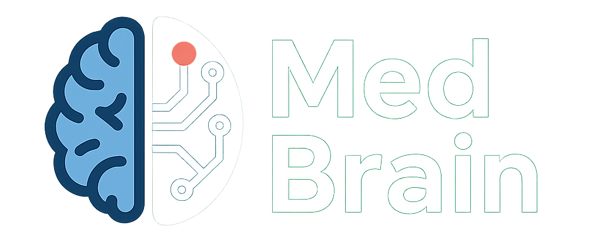
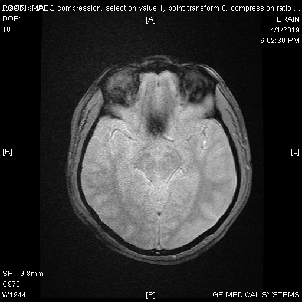
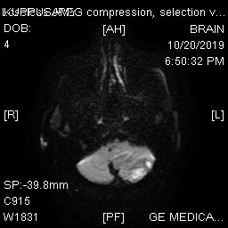
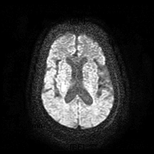
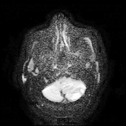
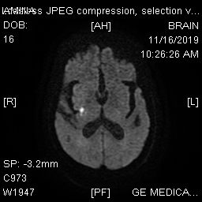

# 🧠 MedBrain - AI-Based Stroke Detection and Classification from MRI Images



**MedBrain** adalah platform berbasis kecerdasan buatan (AI) yang dirancang untuk membantu dokter dan institusi kesehatan dalam menganalisis citra MRI otak serta memprediksi jenis stroke secara otomatis menggunakan teknologi *Convolutional Neural Network* (CNN).

---

## 🧾 Ringkasan

MedBrain meningkatkan efisiensi diagnosis dengan mengurangi waktu yang dibutuhkan untuk mendeteksi stroke melalui analisis otomatis. Sistem ini membantu mendeteksi kasus stroke dengan akurasi tinggi, terutama di daerah yang kekurangan tenaga spesialis, serta memberikan akses ke teknologi analisis citra berbasis machine learning untuk klinik dan rumah sakit yang belum memiliki sistem canggih.

---

## ✨ Fitur Utama

- 🔐 **Autentikasi Pengguna**: Sistem login aman dengan kontrol akses berbasis peran (admin & tenaga kesehatan)
- 👤 **Manajemen Pasien**: kelola history pasien dengan mudah
- 🧠 **Analisis Citra MRI**: Unggah hasil MRI dan dapatkan prediksi stroke berbasis AI
- 📄 **Laporan Detail**: Terima laporan komprehensif dengan skor kepercayaan dan rekomendasi solusi
- 🕓 **Riwayat Pemeriksaan**: Lacak riwayat pemeriksaan dan hasil pasien
- 📊 **Dashboard Admin**: Kelola pengguna dan data sistem secara efisien

---

## 🖼️ Tangkapan Layar

## 🖼️ Tangkapan Layar

**1. Halaman Beranda**  
.png)

**2. Halaman About**  
.png)

**3. Halaman Pendaftaran**  
.png)

**4. Halaman Kontak**  
.png)

**5. Halaman Login**  
.png)

**6. Halaman Prediksi**  
.png)

**7. Halaman Hasil Prediksi**  
.png)

**8. Halaman History**  
.png)

**9. Halaman Dashboard Admin**  
.png)

**10. Halaman Kelola User**  
.png)

**11. Halaman ACC User Baru**  
.png)

---

## 🚀 Akses Demo

🔗 **Live Demo**: [https://medbrain.vercel.app](https://medbrain.vercel.app)

**Akun Demo:**

**user**
- Username: `john doe`
- Password: `12345678`

**admin**
- Username: `admin`
- Password: `12345678`

---

## Gambar untuk deteksi

,
,
,
,
,


## 🛠️ Teknologi yang Digunakan

### 🔧 Frontend

- [Next.js](https://nextjs.org/)
- [Tailwind CSS](https://tailwindcss.com/)
- [Flowbite React](https://flowbite-react.com/)
- [Framer Motion](https://www.framer.com/motion/)
- [Axios](https://axios-http.com/)
- [React Hot Toast](https://react-hot-toast.com/)

### 🖥️ Backend

- [Node.js](https://nodejs.org/) + Express.js
- Mysql untuk database
- [JWT](https://jwt.io/) untuk autentikasi
- tensorflow-node untuk menjalankan model machine learning di server

### 🖥️ Machine Learning
- Google Colab
- Python
- CNN Model untuk deteksi stroke dari citra MRI
- 
### 🚢 Deployment

- Frontend: [Vercel](https://vercel.com/)
- Backend: [Railway](https://railway.app/)

---

## 🔌 API Endpoint Utama

### 🔐 Autentikasi

- `POST /auth/login` – Login pengguna
- `POST /auth/register` – Registrasi pengguna

### 🧠 Prediksi

- `POST /predictions/predict` – Kirim data MRI untuk mendapatkan prediksi stroke

### 👤 Manajemen Pengguna (Admin)

- `GET /admin/users` – Ambil semua pengguna
- `GET /admin/users/:nip` – Ambil data pengguna berdasarkan NIP
- `PUT /admin/users/:nip` – Perbarui data pengguna
- `DELETE /admin/users/:nip` – Hapus pengguna

### 🩺 Manajemen Pasien

- `GET /predictions/predict`` – Ambil semua data pasien dan riwayat prediksi

---

## 💻 Panduan Instalasi

### 📋 Prasyarat

- Node.js v14 atau lebih baru
- npm atau yarn
- Git

### 📦 Langkah Instalasi

1. **Clone repository**
   ```bash
   git clone https://github.com/namapengguna/medbrain.git
   cd medbrain
2. **Instal Depedensi**
   ```bash
   npm install
3. **Konfigurasi API**
   Pastikan file config/config.js atau sejenisnya berisi konfigurasi berikut:
   ```bash
   export const baseURL = "https://your-backend-api-url.com";
4. **Jalankan server lokal**
   ```bash
   npm run dev

### 🏗️ Build untuk Produksi
```bash
npm run build
npm start

### 🏗️ Build untuk Produksi
medbrain/
├── components/         
├── pages/              
├── public/             
├── styles/             
├── utils/              
├── config/             
└── ...

---

© 2025 MedBrain — Diagnosa Stroke Lebih Cepat dan Akurat dengan Kecerdasan Buatan
